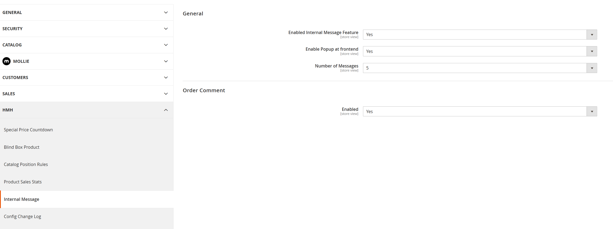

# Hmh_OrderCommentMessage

Magento 2 module that extends Admin Sales comment workflows and integrates them with `Hmh_InternalMessage`.

## Overview

`Hmh_OrderCommentMessage` adds a controlled way for admin users to publish selected sales comments as internal customer messages.

When an admin adds a comment on:
- Order
- Invoice
- Credit Memo
- Shipment

the module can optionally copy that comment into the internal message system, so customers can see it from their account area and popup flow managed by `Hmh_InternalMessage`.

## Features

- Adds admin configuration under:
  - `HMH > Internal Message > Order Comment`
- Adds checkbox on admin comment forms:
  - `Add to internal message`
- Hooks comment add controllers for:
  - Order
  - Invoice
  - Credit Memo
  - Shipment
- Creates internal messages via:
  - `Hmh\InternalMessage\Api\InternalMessageManagementInterface`

## Dependency

- `Hmh_InternalMessage`

## Installation

1. Enable module:
   - `bin/magento module:enable Hmh_OrderCommentMessage`
2. Run setup upgrade:
   - `bin/magento setup:upgrade`
3. Flush cache:
   - `bin/magento cache:flush`

## Config Path

- `hmh_ordercommentmessage/order_comment/enabled`

## Notes

- Default Magento comment workflow remains unchanged.
- Internal message creation is additive behavior.
- Guest orders are skipped (no customer ID).

## Screenshots

Configuration screen for enabling order-comment to internal-message behavior.

Admin order comment form with the option to add the comment as an internal message.

Frontend popup showing recent internal messages for the logged-in customer.

Customer account page listing internal messages.

